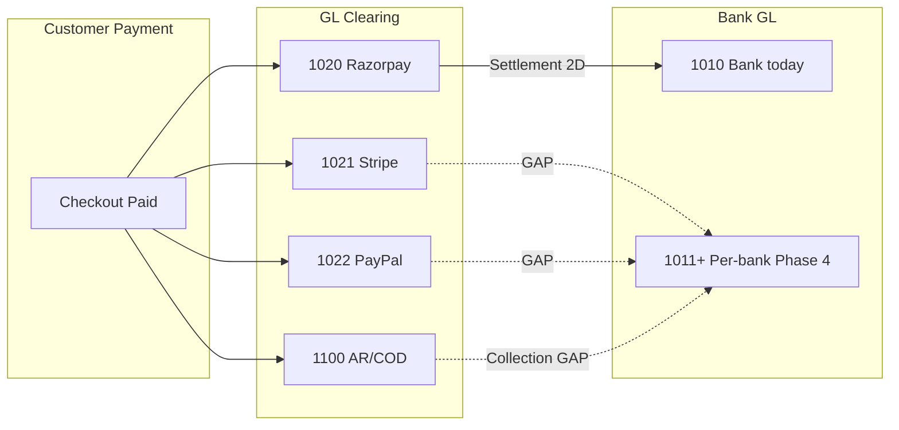

# SARVEDA Native Accounting — Phase 4A Banking & Cash Architecture

**Status:** READ-ONLY DESIGN AUDIT  
**Date:** 2026-08-24  
**Prerequisite:** Phase 3D Inventory / COGS complete and validated  
**Scope:** Architecture only — no schema, code, migration, or data changes in this phase

---

## 1. Executive Summary

Sarveda's native accounting foundation (Phases 1–3D) already posts money movement through a **single generic Bank GL (1010)**, **Cash (1000)**, and **gateway clearing accounts (1020–1022)**. Razorpay settlement shadow posting (Phase 2D) correctly moves funds from **1020 → 1010 + 5100**, but **cannot distinguish HDFC vs ICICI**, **cannot reconcile bank statements**, and **has no transfer/deposit/withdrawal/charge/interest flows**.

**CODE FACT:** There is no `BankAccount`, `AccountingBankAccount`, `BankStatement`, `BankTransfer`, or bank reconciliation model in Prisma or application code today.

**LIGHTSAIL OBSERVATION:** All posted bank activity hits **1010** (5 journal lines, ₹2,07,596 debit / ₹39,900 credit net). **1000 has zero posted journal lines.** Razorpay clearing **1020** shows ₹76,878 net debit outstanding (receipts minus one posted settlement). **1,617 COD orders** (~₹86.3M) exist operationally; **zero COD ORDER_PAID journals** are posted on Lightsail.

**ARCHITECTURAL DECISION:** Adopt **one GL account per physical bank/cash account** (not generic 1010 + opaque subledger), registered in a new **`AccountingBankAccount`** metadata table. Statement import, matching, and reconciliation operate **per bank account** against that account's GL code. Gateway clearing controls remain separate asset accounts (1020–1022, 1100 for COD/AR).

Phase 4 is **not blocked**. The largest risks are **generic 1010 today**, **COD collection DATA_GAP**, and **Stripe/PayPal settlement gaps** — all designable with conservative fail-closed rules.

---

## 2. Existing Banking / Cash Model

### 2.1 Commerce / operational models

| Model / Field | Purpose | Writer | Owner | Mutable | Real bank? | Reconciliation-ready? |
|---------------|---------|--------|-------|---------|------------|----------------------|
| `Payment.provider` | RAZORPAY / STRIPE / PAYPAL / COD | Checkout, webhooks | Commerce | Yes (status) | No | Partial (gateway ID) |
| `Payment.gatewayFeeInPaise` | Fee hint from provider | Webhook / verify | Commerce | Yes | No | No — accounting uses settlement |
| `Payment.settledInPaise` | Cumulative settled amount | Commerce (unused path) | Commerce | Yes | No | **No** — not authoritative for GL |
| `Payment.settlementDate` | Last settlement timestamp | Commerce | Commerce | Yes | No | **No** — 0/1727 Razorpay captured on Lightsail |
| `Payment.providerPaymentId` | Gateway payment ID | Razorpay/Stripe/PayPal | Commerce | Yes | No | Yes — maps to settlement lines |
| `Refund.providerRefundId` | Gateway refund ID | Webhook | Commerce | Yes | No | Yes — settlement recon |
| `Order.status` / `paymentStatus` | Lifecycle | Orders service | Commerce | Yes | No | COD: PAID ≠ cash collected |

**CODE FACT:** `Payment.settledInPaise` / `settlementDate` are **operational hints only**. Phase 2D settlement posting uses **`AccountingGatewaySettlement`**, not `Payment` settlement fields.

### 2.2 Accounting models (existing)

| Model | Purpose | Writer | Owner | Mutable after POST | Real bank? | Reconciliation-ready? |
|-------|---------|--------|-------|-------------------|------------|----------------------|
| `AccountingAccount` | CoA (1000, 1010, 1020…) | Seed script / admin | Accounting | Code/name editable; posted lines immutable | **1010 = generic "Bank"** | Insufficient for multi-bank |
| `AccountingJournalEntry` | Posted journals | Posting services | Accounting | **Immutable** when POSTED | No | Header only |
| `AccountingJournalLine` | Dr/Cr lines | Posting services | Accounting | **Immutable** | Via `accountId` → code | Yes per GL code |
| `AccountingPostingEvent` | Idempotent event log | Discovery/post workers | Accounting | Status transitions | No | Links to journal |
| `AccountingGatewaySettlement` | Razorpay settlement evidence | Settlement import | Accounting | Status/metadata pre-POST | **UTR stored** | **Partial** — no bank account FK |
| `AccountingGatewaySettlementLine` | Per-payment/refund legs | Settlement import | Accounting | Pre-POST | No | Maps to `Payment` |
| `AccountingVendorPayment` | Supplier payment | Admin API | Accounting | DRAFT editable; POSTED immutable | **`paidAccountCode` 1000/1010** | UTR on non-cash |
| `AccountingVendorPaymentAllocation` | Bill allocations | Vendor payment create | Accounting | With payment draft | No | Yes |
| `Expense` | Standalone expense row | Admin/import | Ops/Accounting bridge | Yes | `paidThrough` free text | No — needs mapping |
| `AccountingExpensePaymentMapping` | paidThrough → 1000/1010 | Admin mapping API | Accounting | Yes | No | **Only 2 GL targets** |

**CODE FACT:** No bank statement, transfer, reconciliation, or bank-account registry tables exist.

### 2.3 Search terms — not found in schema

`BankAccount`, `CashAccount`, `BankStatement`, `BankTransfer`, `bank feed`, `IFSC`, `account number` (bank), `reconciliation` (bank-specific), `AccountingBank*` — **absent** except aspirational mention in `SARVEDA_ACCOUNTING_SAFE_ARCHITECTURE_PLAN.md`.

---

## 3. Current CoA Bank Semantics

**CODE FACT** — from `seed-coa.ts` and `order-paid.constants.ts`:

| Code | Name | Used for |
|------|------|----------|
| **1000** | Cash | Vendor payment (CASH), expense payment mapping |
| **1010** | Bank | Razorpay settlement net, vendor BANK/UPI/CHEQUE, expense bank mappings |
| **1020** | Razorpay Clearing | ORDER_PAID Dr; settlement Cr; refund reverse |
| **1021** | Stripe Clearing | ORDER_PAID / refund only |
| **1022** | PayPal Clearing | ORDER_PAID / refund only |
| **1100** | Accounts Receivable | **COD stand-in** on ORDER_PAID ("sale recognised, not cash received") |
| **5100** | Payment Gateway Charges | Razorpay settlement fees (+ tax expensed, ITC unverified) |

### 3.1 Answers to audit questions

| Question | Answer |
|----------|--------|
| Is 1010 a generic single Bank account? | **Yes** — one system account named "Bank". |
| Can multiple real bank accounts be distinguished today? | **No** — no FK, no subledger, no extra GL codes. |
| Vendor payments — account reference? | **`paidAccountCode` string** (`1000` or `1010`), derived from `paymentMethod` via `PAYMENT_METHOD_TO_ACCOUNT`. |
| Expenses — payment source? | **`AccountingExpensePaymentMapping.paidAccountCode`** → only `1000` or `1010`. |
| Gateway settlements — target bank? | **Hard-coded `ACCOUNT_CODE.BANK` (1010)** in `settlement-journal.builder.ts`. |
| Manual journals to different banks? | **No manual journal API** exists. `journal.service.ts` supports programmatic post only. Any future manual entry would use `accountId` — could target any CoA code if added. |

**ARCHITECTURAL DECISION:** Sarveda **cannot** today represent HDFC Current vs ICICI Current vs Petty Cash on the balance sheet or in reconciliation.

---

## 4. Multiple Bank Account Strategy

### 4.1 Options evaluated

| Criterion | A: One GL per physical account | B: Generic 1010 + subledger |
|-----------|-------------------------------|----------------------------|
| Balance sheet | Natural — each bank is its own asset line | Requires subledger report; 1010 is meaningless aggregate |
| Reconciliation | Book balance = GL activity for that code | Must reconcile subledger to 1010 **and** statement |
| Transfers | Dr ICICI / Cr HDFC — standard | Same, but subledger must mirror or dimension journal lines |
| Auditability | Journal lines are self-explanatory | Risk of subledger/GL drift |
| Simplicity | Add CoA rows + registry | Extra sync layer on every posting |
| Bank feeds | One feed → one GL code | Feed → subledger → must allocate to 1010 |
| Vendor/settlement mapping | Point to `AccountingBankAccount.id` → `glAccountCode` | Every posting needs bankAccountId dimension |

### 4.2 Recommendation

**Adopt Option A: one GL account per physical bank/cash account**, with **`AccountingBankAccount`** as the operational registry (name, masked number, IFSC, currency, `glAccountCode`, active flag).

**CoA numbering proposal (ARCHITECTURAL DECISION):**

| Code | Account |
|------|---------|
| 1000 | Cash on Hand (retain; system) |
| 1001 | Petty Cash (optional, future) |
| 1010 | **Deprecated aggregate / migration holding** OR reassign to primary bank at cutover |
| 1011+ | Per-bank GL codes (HDFC Current, ICICI Current, …) |

**Migration policy:** Historical journals on **1010 remain immutable** on 1010. New postings target specific bank GL codes. At cutover, **opening bank balance entry** per real account offsets **3900 Opening Balance Equity**. Optional memo documents 1010 legacy balance.

**Do not use Option B** (generic 1010 + subledger without GL split) — it complicates reconciliation and transfers without benefit at Sarveda's scale.

---

## 5. AccountingBankAccount Design

### 5.1 Proposed model (design only)

```
AccountingBankAccount
  id                    UUID PK
  name                  "HDFC Current — Main"
  bankName              "HDFC Bank"
  maskedAccountNumber   "****4567"     -- last 4 only
  ifsc                  "HDFC0001234"  -- optional for non-IN
  currency              "INR"
  glAccountCode         "1011"         -- UNIQUE, FK to AccountingAccount.code
  accountType           BANK | CASH | PETTY_CASH
  isActive              boolean
  isDefault             boolean       -- one default per type for UX fallbacks
  openingBalanceInPaise int           -- cutover helper, not live authority
  openingDate           date
  statementImportEnabled boolean
  razorpaySettlementTarget boolean    -- at most one RAZORPAY target recommended
  createdAt / updatedAt
  createdByUserId
```

**Fields genuinely needed:** `id`, `name`, `bankName`, `maskedAccountNumber`, `currency`, `glAccountCode`, `accountType`, `isActive`, `isDefault`, `statementImportEnabled`, `razorpaySettlementTarget` (optional but high value), timestamps, `createdByUserId`.

**Optional:** `ifsc` (India NEFT/RTGS matching), `openingBalanceInPaise` + `openingDate` (cutover wizard only).

**Do NOT store:** full account number, net banking passwords, API keys, customer PAN/Aadhaar.

### 5.2 Cash model

**ARCHITECTURAL DECISION:** **No separate `AccountingCashAccount` table.** Use `AccountingBankAccount` with `accountType = CASH | PETTY_CASH` and GL codes **1000 / 1001**. Cash is low-volume; one registry table reduces duplication.

### 5.3 GL account creation

When admin adds `AccountingBankAccount`:

1. Validate `glAccountCode` is unused ASSET account.
2. Create `AccountingAccount` row (or link existing).
3. Register bank account pointing to it.

System accounts **1020–1022, 1100** remain gateway/AR controls — **not** bank accounts.

---

## 6. Gateway → Bank Lifecycle

### 6.1 Razorpay (implemented)

**CODE FACT — journal lifecycle:**

```
ORDER_PAID (ORDER_PAID_V1):
  Dr 1020 Razorpay Clearing     (grand total)
  Cr 4000/4100/4200 + 2100/2101/2102

ORDER_REFUNDED_FULL (if posted):
  Reverse clearing side (Cr 1020 …)

PAYMENT_GATEWAY_SETTLED (PAYMENT_GATEWAY_SETTLED_V1):
  Dr 1010 Bank                  (net)
  Dr 5100 Gateway Charges       (fee + tax per mode detection)
  Cr 1020 Razorpay Clearing     (payment gross)
  Dr 1020 Razorpay Clearing     (refund gross recovery, if any)
```

**Missing for true bank reconciliation:**

- Target bank account is **not configurable** (always 1010).
- No link from settlement journal to **`AccountingBankAccount`**.
- No statement line match to settlement UTR (UTR stored on settlement row only).
- `Payment.settlementDate` / `settledInPaise` **not updated** by accounting (commerce fields stale).

### 6.2 Stripe / PayPal

**CODE FACT:**

```
ORDER_PAID:
  Dr 1021 / 1022 Clearing
  Cr revenue + GST

ORDER_REFUNDED_FULL:
  Reverse clearing (if posted)

Settlement → Bank:
  NOT IMPLEMENTED
```

**LIGHTSAIL OBSERVATION:** STRIPE 107 captured (₹5.28M), PAYPAL 44 captured (₹7.6L) — **zero clearing balance** on 1021/1022 because **no ORDER_PAID journals posted** for those providers on Lightsail (only Razorpay test orders posted).

**Phase 4 gap:** Need **STRIPE_SETTLED_V1 / PAYPAL_SETTLED_V1** (or generic `PAYMENT_GATEWAY_SETTLED` with provider dimension) mirroring Razorpay pattern: Dr Bank, Dr 5100, Cr 102x Clearing.

### 6.3 COD

**CODE FACT:**

```
ORDER_PAID (COD):
  Dr 1100 Accounts Receivable   (memo: "COD sale recognised (not cash received)")
  Cr revenue + GST
```

Payment row may stay **`PENDING`** while order is **`PAID`** (shipping router treats COD as shippable when order PAID).

**No collection journal exists:** Dr 1000 / Cr 1100 is **not implemented**.

**ORDER_REFUNDED_FULL:** `COD_NOT_AUTO_POSTABLE` — refunds require manual evidence.

### 6.4 End-to-end diagram



---

## 7. Razorpay Settlement Review (Phase 2D)

### 7.1 Implementation summary (CODE FACT)

| Aspect | Current behavior |
|--------|------------------|
| Event source | Razorpay API via `razorpay-settlement.adapter.ts` + `settlement-import.service.ts` |
| Settlement ID | `providerSettlementId` — unique `(provider, providerSettlementId)` |
| Amounts | `grossInPaise`, `feeInPaise`, `taxInPaise`, `netInPaise` on header |
| Target bank | **Always GL 1010** — not configurable |
| UTR | `AccountingGatewaySettlement.utr` — required for posting; indexed |
| Reconciliation | `buildSettlementBatchReconciliation` — **settlement ↔ payments**, not bank statement |
| Posting event | `PAYMENT_GATEWAY_SETTLED` / uniqueKey `provider:razorpay:settlement:{id}` |
| Journal link | `journalEntryId` on settlement row |
| Line mapping | Maps recon lines to `Payment` / `Refund` by provider IDs |
| Fee double-post | Fees expensed at settlement to **5100** — bank statement must **not** re-expense same fee |

**LIGHTSAIL OBSERVATION:**

| Settlement ID | UTR | Net (₹) | Status |
|---------------|-----|---------|--------|
| setl_TS0efFrJpgfPDo | AXISCN1442815623 | 2,075.96 | POSTED |
| setl_TRU0w9ZcWNXBxO | AXISCN1441135202 | 3,856.16 | PREVIEWED |

### 7.2 Phase 4 improvements required

1. **`targetBankAccountId`** on settlement (or derive from default Razorpay target).
2. Post to **`glAccountCode`** of selected `AccountingBankAccount`, not hard-coded 1010.
3. **Statement match** entity: link statement line ↔ settlement via **UTR + amount + date window**.
4. **Duplicate fee detection** when matching bank debits to 5100/settlement fee.
5. Optionally backfill `Payment.settlementDate` / `settledInPaise` (commerce) — **out of scope unless explicitly requested**; accounting should not depend on it.

---

## 8. Vendor Payment Review (Phase 3C1)

### 8.1 Current behavior (CODE FACT)

| Field | Behavior |
|-------|----------|
| `paymentMethod` | BANK_TRANSFER, UPI, CHEQUE → **1010**; CASH → **1000** |
| `paidAccountCode` | Stored explicitly; must match method mapping |
| `utr` | Required for non-CASH (min 3 chars) |
| `paymentDate` | Accounting date |
| `amountInPaise` | Single amount; allocations must sum exactly |
| Journal | Dr **2000 AP** / Cr **1000 or 1010** |
| Idempotency | `vendor_payment:{paymentId}` |
| Immutability | POSTED payments immutable (`VendorPaymentImmutableError`) |

**LIGHTSAIL OBSERVATION:** 2 POSTED vendor payments, both **1010**, UTRs present (test fixtures).

### 8.2 Multi-bank migration (ARCHITECTURAL DECISION)

1. Add **`bankAccountId`** (FK `AccountingBankAccount`) on `AccountingVendorPayment`.
2. Resolve credit line to **`bankAccount.glAccountCode`** instead of `PAYMENT_METHOD_TO_ACCOUNT` constant.
3. **Backward compatibility:** If `bankAccountId` null, fall back to legacy `paidAccountCode` (1000/1010).
4. Admin UI: bank account picker filtered by `accountType` + method (CASH → cash accounts only).
5. Existing POSTED rows: **do not rewrite journals** — remain on 1010.

---

## 9. Expense Payment Review (Phase 3C2)

### 9.1 Current behavior (CODE FACT)

- `Expense.paidThrough` — free text (e.g. "NEFT", "Cash").
- `AccountingExpensePaymentMapping` — maps normalized name → **`1000` or `1010` only** (`expense-mapping.service.ts` enforces).
- Journal: Dr expense (+ input GST) / Cr **1000 or 1010**.
- `Expense.referenceNumber` — supplier invoice ref, **not UTR**.

**LIGHTSAIL OBSERVATION:** 2 expenses, 2 with paidThrough; mappings: 7×1010, 1×1000 active.

### 9.2 Multi-bank path (ARCHITECTURAL DECISION)

**Do not** extend `AccountingExpensePaymentMapping` with unlimited GL codes — combinatorial explosion.

**Instead:**

1. Map `paidThrough` → **`AccountingBankAccount.id`** (or default bank account).
2. Journal credit uses **`bankAccount.glAccountCode`**.
3. Migration: existing mappings pointing to 1010 → default bank account's GL code when cutover completes.
4. Optional: store **`paymentReference`** (UTR) on expense posting metadata for statement matching — requires ops field or admin entry at post time.

---

## 10. Bank Transfers

### 10.1 Design

Internal transfer (HDFC → ICICI):

```
Dr 1012 ICICI Bank    ₹1,00,000
    Cr 1011 HDFC Bank  ₹1,00,000
```

**No P&L impact.**

### 10.2 Proposed model: `AccountingBankTransfer`

| Field | Purpose |
|-------|---------|
| id | UUID |
| transferNumber | `BT-YYYYMM-SEQ` |
| transferDate | Accounting date |
| amountInPaise | Single currency amount |
| currency | INR V1 |
| sourceBankAccountId | FK |
| destBankAccountId | FK |
| reference / utr | External reference |
| memo | Optional |
| status | DRAFT → POSTED → VOID |
| sourcePayloadHash | Idempotency fingerprint |
| journalEntryId | Posted journal |
| postingEventId | `BANK_TRANSFER` event |
| createdByUserId | Audit |

**Unique key:** `bank_transfer:{sourceBankAccountId}:{destBankAccountId}:{transferDate}:{amountInPaise}:{referenceNormalized}` — tighten with hash of full payload.

**Dedicated model warranted:** Yes — transfers are user-initiated, need approval audit, distinct from gateway settlement and vendor payment.

---

## 11. Cash Deposit / Cash Withdrawal

### 11.1 Design

**Cash deposit (cash → bank):**

```
Dr Bank (101x)
    Cr Cash (1000)
```

**Cash withdrawal (bank → cash):**

```
Dr Cash (1000)
    Cr Bank (101x)
```

### 11.2 Reuse transfer model?

**ARCHITECTURAL DECISION:** **Reuse `AccountingBankTransfer`** with `transferKind` enum:

- `INTERNAL_TRANSFER` — bank ↔ bank  
- `CASH_DEPOSIT` — cash → bank (source = cash account)  
- `CASH_WITHDRAWAL` — bank → cash (dest = cash account)

Validation: source/dest must differ; one side must be `accountType CASH/PETTY_CASH`. Same journal builder, same idempotency pattern. **No separate model needed.**

---

## 12. Bank Charges

### 12.1 Design

Direct bank fees **not** already in Razorpay settlement:

```
Dr 5390 Bank Charges Expense   (new CoA — or 5380 Misc with memo)
    Cr Bank (101x)
```

### 12.2 Proposed model: `AccountingBankCharge`

| Field | Notes |
|-------|-------|
| bankAccountId | Which account debited |
| chargeDate | |
| amountInPaise | |
| expenseAccountCode | Default 5390 |
| reference | Bank narrations |
| memo | |
| status / journal / event | Same pattern as transfer |

**Duplicate detection (CRITICAL):**

- Before auto-matching or posting charge, check:
  - Same date/amount as **5100** settlement fee line?
  - Same UTR as **`AccountingGatewaySettlement.utr`**?
- Statement import line matching settlement fee → **`MATCHED_EXACT` to settlement journal**, not new expense.

**Unique key:** `bank_charge:{bankAccountId}:{chargeDate}:{amountInPaise}:{referenceHash}`

---

## 13. Bank Interest / Credits

### 13.1 Interest received

```
Dr Bank (101x)
    Cr 4500 Interest Income   (new REVENUE account — design)
```

### 13.2 Unknown credits

**ARCHITECTURAL DECISION:** **Never auto-post to income.**

Statement import → `UNMATCHED` or `REVIEW_REQUIRED` until admin categorizes:

- Interest income  
- Transfer from another owned account  
- Customer refund reversal  
- Gateway adjustment  
- Ignore (duplicate)

Model: **`AccountingBankCredit`** or generic **`AccountingBankAdjustment`** with `adjustmentType` enum (`INTEREST`, `REFUND`, `OTHER_INCOME`, `TRANSFER_IN`, `UNKNOWN`).

---

## 14. Bank Statement Import

### 14.1 V1 design — evidence only, no auto-GL

**Models:**

```
AccountingBankStatementImport
  id
  bankAccountId
  fileName
  fileSha256              -- duplicate import protection
  importedAt
  importedByUserId
  periodStart / periodEnd  -- optional hints
  status                  PREVIEW | COMMITTED | FAILED | SUPERSEDED
  lineCount
  currency

AccountingBankStatementLine
  id
  importId
  fingerprint             -- deterministic hash(bankAccountId|date|amount|ref|description)
  transactionDate
  valueDate
  description
  reference               -- UTR / cheque / narrations
  debitInPaise
  creditInPaise
  balanceInPaise          -- optional from statement
  status                  -- see §15
  matchConfidence         -- EXACT | HIGH | POSSIBLE | NO_MATCH
  matchedJournalEntryId   -- nullable
  matchedEntityType       -- SETTLEMENT | VENDOR_PAYMENT | EXPENSE | TRANSFER | ...
  matchedEntityId
  createdAt
```

### 14.2 Requirements

| Requirement | Design |
|-------------|--------|
| Preview before commit | Parse XLSX/CSV → in-memory preview API; no lines persisted until COMMITTED |
| Duplicate import | Reject if `fileSha256` exists for same `bankAccountId`; line `fingerprint` unique per account |
| Account selection | Required `bankAccountId` on import |
| Date/currency validation | Fail rows with invalid dates; reject non-INR in V1 |
| No direct GL from import | Import creates **lines only**; posting happens via match confirmation or manual categorize |

**Supported formats V1:** CSV + XLSX (same pattern as opening inventory import — multer memory, Zod row validation).

---

## 15. Bank Statement Line State

### 15.1 Status enum

| Status | Meaning |
|--------|---------|
| `UNMATCHED` | No candidate |
| `MATCHED_EXACT` | Auto-confirmed deterministic match |
| `MATCHED_MANUAL` | User confirmed |
| `PARTIAL` | Split across multiple journals (rare V1) |
| `IGNORED` | Duplicate / noise / internal transfer already booked |
| `DUPLICATE` | Fingerprint collision within import or prior import |
| `REVIEW_REQUIRED` | Candidate exists but confidence < auto threshold |

### 15.2 Link cardinality

**ARCHITECTURAL DECISION:**

- **Default: many statement lines → one journal** (e.g. one vendor payment UTR matches one bank debit).
- **One statement line → many journals:** supported via **`AccountingBankStatementMatch`** join table for PARTIAL/split cases (V2; defer if not needed in 4C).
- **One journal → many statement lines:** rare (batch deposit); allow multiple lines linked to same settlement journal only if sum matches net.

---

## 16. Matching Architecture

### 16.1 Conservative rules (ARCHITECTURAL DECISION)

| Priority | Evidence | Confidence |
|----------|----------|------------|
| 1 | UTR exact + amount exact + bank account + date ±3 days | **EXACT** → auto-confirm |
| 2 | Settlement ID in narration + amount exact | **EXACT** for Razorpay |
| 3 | Vendor payment UTR + amount + date window | **HIGH** → review queue |
| 4 | Expense reference + amount | **POSSIBLE** |
| 5 | Amount only | **NO_MATCH** — never auto |

### 16.2 Match targets

- `AccountingGatewaySettlement` (+ journal) — UTR, net amount  
- `AccountingVendorPayment` — UTR, amount, paymentDate  
- `AccountingPostingEvent` / journal — expense, transfer, charge  
- `AccountingBankTransfer` — reference, amount  

### 16.3 Auto-confirm policy

Only **`EXACT`** confidence auto-sets `MATCHED_EXACT`. **`HIGH`** → `REVIEW_REQUIRED` with suggested link. Admin bulk-confirm UI for HIGH after spot check.

---

## 17. Bank Reconciliation

### 17.1 Equation

```
Opening Book Balance (GL glAccountCode)
+ Sum(debits) − Sum(credits)   [posted journals, entryDate ≤ periodEnd]
= Book Closing Balance

Statement Closing Balance (from import or manual entry)

Difference = Book Closing − Statement Closing
```

### 17.2 Reconciliation period

**One reconciliation per `AccountingBankAccount` per period** (typically monthly).

Surface:

| Item | Source |
|------|--------|
| Deposits in transit | Statement credit UNMATCHED; book has no match |
| Settlements pending | 1020 net balance (Razorpay dashboard) |
| Unpresented payments | Vendor payments POSTED; statement UNMATCHED debit |
| Bank charges not in books | Statement debit UNMATCHED |
| Credits not in books | Statement credit UNMATCHED |
| Duplicate statements | Import fingerprint collision |
| Date mismatches | valueDate vs entryDate > threshold → flag |

---

## 18. Reconciliation Model

### 18.1 `AccountingBankReconciliation`

| Field | Purpose |
|-------|---------|
| bankAccountId | FK |
| periodStart / periodEnd | |
| statementOpeningBalanceInPaise | From statement or prior recon |
| statementClosingBalanceInPaise | |
| bookClosingBalanceInPaise | Computed at reconcile time |
| differenceInPaise | |
| status | OPEN \| IN_PROGRESS \| RECONCILED \| REOPENED |
| reconciledAt / reconciledByUserId | |
| notes | |
| snapshotJson | Point-in-time unmatched counts |

**REOPENED:** Allows new statement lines; **does not mutate posted journals** — only match state changes.

---

## 19. Opening Bank / Cash Balances

At cutover:

```
Dr 1011 HDFC Bank     ₹X
Dr 1012 ICICI Bank    ₹Y
Dr 1000 Cash          ₹Z
    Cr 3900 Opening Balance Equity   ₹(X+Y+Z)
```

(or reverse if overdraft — unlikely V1)

**Process:**

1. Admin creates `AccountingBankAccount` rows with cutover **statement** balances as of cutover date.
2. **`BANK_OPENING_BALANCE_V1`** posting event — one journal per account or consolidated with line memos.
3. Must tie to **physical bank statement** on cutover date — **do not invent real values** in implementation/testing.

**LIGHTSAIL OBSERVATION:** Current 1010 book net from posted journals ≠ any real bank balance — expected for shadow/test posting.

---

## 20. Cash Reconciliation

**ARCHITECTURAL DECISION:** **Lightweight V1** — Sarveda is e-commerce; cash is secondary (COD collection gap, petty cash).

Optional model **`AccountingCashCount`:**

- `bankAccountId` (cash type)  
- `countDate`  
- `countedAmountInPaise`  
- `bookBalanceInPaise` (computed)  
- `differenceInPaise`  
- `countedByUserId`  

No full cashbook unless COD collection implemented. **Defer heavy cashbook to Phase 4D+ if COD remains manual.**

---

## 21. COD Collection

### 21.1 Operational flow (CODE FACT)

1. Checkout creates order **PAID** with `Payment.provider = COD`, `Payment.status` often **PENDING**.
2. Shipping allowed when order PAID (COD path in `shipping/router.ts`).
3. Courier collects cash on delivery — **no structured remittance event** in schema.
4. No Shiprocket/Delhivery webhook fields for "COD remitted to bank" found in accounting-relevant models.

### 21.2 Accounting today

- **ORDER_PAID** → Dr **1100 AR** (when posted).
- **No** Dr Cash / Cr AR collection journal.
- **ORDER_REFUNDED_FULL** → `COD_NOT_AUTO_POSTABLE`.

### 21.3 DATA_GAP

**ARCHITECTURAL DECISION:** Mark **`COD_COLLECTION = DATA_GAP`**.

Possible future evidence sources (design only — **do not implement without ops event**):

| Source | Feasibility |
|--------|-------------|
| Courier remittance report | Needs new import model + partner API |
| Manual admin "COD batch deposit" | `AccountingCodRemittance` batch → Dr Bank / Cr 1100 |
| Bank statement credit matching | Weak alone — amount-only insufficient |

**Do NOT treat DELIVERED as collected.**

Phase 4D should design **`COD_REMITTANCE_V1`** placeholder event but gate on **`ACCOUNTING_COD_COLLECTION_ENABLED`** default OFF until ops evidence exists.

---

## 22. Gateway Clearing Controls

### 22.1 Control equation (per clearing account)

```
Opening Balance
+ ORDER_PAID debits to clearing
− SETTLEMENT credits from clearing
± REFUND reversals
= Outstanding Clearing Balance
```

**LIGHTSAIL OBSERVATION (posted journals only):**

| Account | Net balance (₹) |
|---------|-----------------|
| 1020 Razorpay | 76,878 |
| 1021 Stripe | 0 |
| 1022 PayPal | 0 |
| 1100 AR | 0 |

(Razorpay outstanding reflects test ORDER_PAID postings minus one settlement.)

### 22.2 Dashboard section (design)

Per gateway:

- Outstanding clearing (GL net)  
- Count unsettled captured payments (commerce query)  
- Last settlement date / amount  
- Aging buckets (optional V2)

---

## 23. Banking Dashboard

### 23.1 Admin overview (design)

**Per bank/cash account (`AccountingBankAccount`):**

| Widget | Source |
|--------|--------|
| Book balance | Sum POSTED journal lines for `glAccountCode` |
| Latest statement balance | Last committed import |
| Unreconciled difference | Active reconciliation |
| Unmatched statement lines | Count by status |
| Last reconciliation date | `AccountingBankReconciliation` |

**Gateway clearing section:**

- Razorpay / Stripe / PayPal / COD outstanding  
- Link to settlement import (Razorpay)  
- Stripe/PayPal "settlement not configured" badge  

**Route proposal:** `/admin/accounting/banking` (frontend), `GET /api/admin/accounting/banking/dashboard` (backend).

---

## 24. Security

**CODE FACT:** Accounting routes under `/api/admin/accounting/*` require **`requireAdmin`** (`admin.routes.ts`). No finer-grained accounting RBAC today.

### 24.1 Recommendations (ARCHITECTURAL DECISION)

| Action | Role V1 | Notes |
|--------|---------|-------|
| View bank accounts / balances | ADMIN | Mask account numbers in UI (`****4567`) |
| Import statements | ADMIN | Audit log every import |
| Post transfers / charges | ADMIN | Consider SUPER_ADMIN for production |
| Reconcile / confirm matches | ADMIN | Two-person rule optional V2 |
| View full UTR | ADMIN | OK — not secret like API keys |

**Audit:** Extend `AccountingAuditLog` actions: `BANK_ACCOUNT_CREATED`, `STATEMENT_IMPORTED`, `BANK_TRANSFER_POSTED`, `RECONCILIATION_CLOSED`, `STATEMENT_LINE_MATCHED`.

**Logs/reports:** Never log full account numbers, API keys, or raw statement files in application logs.

**File upload:** Statement import via multer memory — virus scan optional; **no execution** of uploaded content (aligns with security-hardening rule).

---

## 25. Immutability

**CODE FACT:** `PostedJournalImmutableError` in `journal.service.ts` — POSTED/VOID entries cannot be edited.

**ARCHITECTURAL DECISION (unchanged for Phase 4):**

- Corrections via **reversal journal** (void pattern) + replacement transaction.  
- Reopened reconciliation adjusts **match links only**, not journals.  
- Bank account registry: `glAccountCode` **immutable after first POSTED journal** — deactivate instead.

---

## 26. Idempotency / Concurrency

### 26.1 Unique keys (proposed)

| Event | Unique key pattern |
|-------|-------------------|
| BANK_TRANSFER | `bank_transfer:{transferId}` |
| BANK_CHARGE | `bank_charge:{chargeId}` |
| BANK_INTEREST | `bank_interest:{creditId}` |
| BANK_OPENING | `bank_opening:{bankAccountId}:cutover` |
| BANK_STATEMENT_IMPORT | `(bankAccountId, fileSha256)` UNIQUE |
| BANK_STATEMENT_LINE | `(bankAccountId, fingerprint)` UNIQUE |
| BANK_MATCH | `(statementLineId, journalEntryId)` UNIQUE |

### 26.2 Concurrency

- All post paths in **PostgreSQL transaction** with row locks on posting event (`eventType, uniqueKey` unique constraint — existing pattern).  
- Statement commit: **`INSERT … ON CONFLICT DO NOTHING`** for fingerprints.  
- **No JS mutexes.**

---

## 27. Feature Flags

**Recommend (default OFF):**

| Flag | Gates |
|------|-------|
| `ACCOUNTING_BANKING_ENABLED` | Master — bank accounts, transfers, charges |
| `ACCOUNTING_BANK_STATEMENT_IMPORT_ENABLED` | Import preview + commit |
| `ACCOUNTING_BANK_RECONCILIATION_ENABLED` | Reconciliation workflow |
| `ACCOUNTING_COD_COLLECTION_ENABLED` | Future COD remittance posting |

Nested under existing:

- `NATIVE_ACCOUNTING_ENABLED=1`  
- `ACCOUNTING_PRODUCTION_POSTING_ALLOWED=1` for production persistence  

**Import preview:** read-only parsing allowed when posting disabled; commit requires flags + production guard.

---

## 28. Real Data / Migration Policy

| Stage | Use |
|-------|-----|
| Synthetic / local | Correctness, unit tests, journal builders |
| Lightsail | Integration safety, shadow validation scripts |
| Real bank / Zoho / team | Final cutover reconciliation only |

**Do not block Phase 4** on messy historical Zoho/Lightsail bank data. **Do not invent real bank balances** in docs or test fixtures labeled as production truth.

**1010 legacy:** Leave historical POSTED journals on 1010; new accounts get 1011+; opening entry establishes true cutover positions.

---

## 29. Lightsail Read-Only Findings

**Environment:** Lightsail Postgres via `ubuntu@13.204.112.165` (read-only SQL, 2026-08-24).

| Observation | Value |
|-------------|-------|
| CoA 1000–1100 | Present as designed |
| Posted journal lines on **1010** | 5 lines; ₹2,07,596 Dr / ₹39,900 Cr |
| Posted journal lines on **1000** | **0** |
| Vendor payments POSTED | 2 — both **1010**, with UTR |
| Gateway settlements | 1 POSTED (₹2,075.96 net, UTR AXISCN1442815623), 1 PREVIEWED |
| Expense payment mappings active | 7→1010, 1→1000 |
| Expense rows | 2 (both with paidThrough) |
| COD orders (paid pipeline) | **1,617** orders, **₹86,296,644.46** grand total |
| COD ORDER_PAID posted | **0** |
| Stripe CAPTURED | 107 payments, ₹52,82,806.4 |
| PayPal CAPTURED | 44 payments, ₹7,60,841 |
| Clearing balances (posted) | 1020: ₹76,878; 1021/1022/1100: ₹0 |
| Razorpay Payment settlement fields | 0/1727 with settlementDate or settledInPaise |

**Posted event counts:** ORDER_PAID 8, VENDOR_PAYMENT_MADE 2, PAYMENT_GATEWAY_SETTLED 1, EXPENSE_RECORDED 2, others inventory-related.

Label: **LIGHTSAIL OBSERVATION** — shadow/test accounting; not production cutover state.

---

## 30. Proposed Phase 4 Implementation Slices

Smallest safe sub-slices (**ARCHITECTURAL DECISION**):

### Phase 4B — Bank/Cash foundation + transfer engine

- `AccountingBankAccount` + CoA extension (1011+, 5390, 4500)  
- CRUD admin API + seed migration helper  
- `AccountingBankTransfer` (+ CASH_DEPOSIT/WITHDRAWAL kinds)  
- `BANK_TRANSFER_V1` posting, flags, tests  
- Wire **vendor payment** + **settlement** + **expense** to optional `bankAccountId` (fallback 1010)  
- Opening balance posting template (no real amounts)

**Exit:** Transfers post correctly; vendor payment can target a specific bank GL.

### Phase 4C — Statement import + matching

- `AccountingBankStatementImport` / `Line`  
- CSV/XLSX parser, preview, commit  
- Fingerprint dedup  
- Conservative matcher (UTR-first)  
- Admin UI: import + unmatched queue  

**Exit:** Import Razorpay settlement UTR line → EXACT match to existing settlement journal.

### Phase 4D — Reconciliation + gateway controls + COD design

- `AccountingBankReconciliation`  
- Reconciliation report + reopen  
- Gateway clearing dashboard (1020–1022, 1100)  
- Bank charges/interest posting  
- **`COD_REMITTANCE_V1` design stub** (flag OFF, DATA_GAP documented)  
- Stripe/PayPal settlement **design spike** (adapter interface; implement when provider evidence available)

**Exit:** Monthly recon closes for one bank account on Lightsail test data.

### Phase 4E — Hardening + Lightsail validation

- `phase4-lightsail-banking-validation.ts` script  
- Security audit on upload paths  
- Duplicate fee tests (settlement vs bank charge)  
- Full regression + documentation  

**Combine 4B+4C only if transfer + import share substantial plumbing** — otherwise keep separate for reviewability.

---

## 31. Risk Matrix

| Risk | Rating | Mitigation |
|------|--------|------------|
| Generic 1010 bank account today | **HIGH** | 4B bank registry + new GL codes; fallback for legacy |
| Multiple-bank migration | **MEDIUM** | Immutable old journals; opening entry; default bank mapping |
| Statement duplicate imports | **MEDIUM** | fileSha256 + line fingerprint UNIQUE |
| Amount-only matching | **HIGH** | Never auto-match; EXACT requires UTR/reference |
| Settlement → bank mapping | **MEDIUM** | `targetBankAccountId` on settlement; UTR match |
| Vendor-payment bank mapping | **MEDIUM** | `bankAccountId` FK; UTR already stored |
| Expense bank mapping | **MEDIUM** | Map paidThrough → bank account not just 1010 |
| COD collection gap | **HIGH** | DATA_GAP; manual remittance design; flag OFF |
| Bank balance cutover | **HIGH** | Opening balance equity; statement tie-out; no invented values |
| Security (statement upload) | **MEDIUM** | Admin-only, audit, masked numbers, no secrets in logs |
| Manual journals hitting bank | **LOW** | No manual API today; future must pick bankAccount |
| Reconciliation reopening | **MEDIUM** | Match-only mutation; audit trail |
| Historical migrated bank data | **MEDIUM** | Policy: synthetic → Lightsail → real cutover |

**BLOCKER:** None identified for starting Phase 4B.

---

## 32. Files Future Implementation Will Touch

### Schema / migrations

- `backend/prisma/schema.prisma`  
- `backend/prisma/migrations/20260825*_accounting_phase4b_banking/` (example)

### Accounting module (new)

- `backend/src/modules/accounting/bank-account.service.ts`  
- `backend/src/modules/accounting/bank-account.constants.ts`  
- `backend/src/modules/accounting/bank-transfer.service.ts`  
- `backend/src/modules/accounting/bank-transfer-journal.builder.ts`  
- `backend/src/modules/accounting/bank-transfer-posting.service.ts`  
- `backend/src/modules/accounting/bank-charge*.ts`  
- `backend/src/modules/accounting/bank-statement-import.service.ts`  
- `backend/src/modules/accounting/bank-statement-match.service.ts`  
- `backend/src/modules/accounting/bank-reconciliation.service.ts`  
- `backend/src/modules/accounting/gateway-clearing-dashboard.service.ts`  
- `backend/scripts/phase4*-lightsail-banking-validation.ts`

### Accounting module (modify)

- `backend/src/modules/accounting/seed-coa.ts` — new bank/expense/income codes  
- `backend/src/modules/accounting/accounting-flag.ts` — banking flags  
- `backend/src/modules/accounting/production-guard.ts` — banking assert helpers  
- `backend/src/modules/accounting/accounting-errors.ts`  
- `backend/src/modules/accounting/accounting.handlers.ts`  
- `backend/src/modules/accounting/accounting.routes.ts`  
- `backend/src/modules/accounting/settlement-journal.builder.ts` — target bank GL  
- `backend/src/modules/accounting/settlement-posting.service.ts`  
- `backend/src/modules/accounting/vendor-payment.service.ts`  
- `backend/src/modules/accounting/vendor-payment-journal.builder.ts`  
- `backend/src/modules/accounting/expense-mapping.service.ts`  
- `backend/src/modules/accounting/expense-journal.builder.ts`  
- `backend/src/modules/accounting/accounting-audit.service.ts` — new audit actions  

### Tests

- `backend/test/accounting/bank-account.test.ts`  
- `backend/test/accounting/bank-transfer.test.ts`  
- `backend/test/accounting/bank-statement-import.test.ts`  
- `backend/test/accounting/bank-reconciliation.test.ts`  
- `backend/test/accounting/api-security.test.ts` — extend  

### Frontend

- `frontend/lib/accounting-api.ts`  
- `frontend/app/admin/accounting/banking/page.tsx` (new)  
- `frontend/app/admin/accounting/banking/[accountId]/page.tsx`  
- `frontend/app/admin/accounting/banking/import/page.tsx`  
- `frontend/app/admin/accounting/banking/reconcile/page.tsx`  
- `frontend/app/admin/accounting/settlements/page.tsx` — bank account selector  
- `frontend/app/admin/accounting/vendor-payments/page.tsx` — bank account picker  
- Admin shell nav link to Banking  

### Docs

- `SARVEDA_ACCOUNTING_PHASE4B_*.md`, etc.

**Not in Phase 4 scope:** payment webhooks, commerce `Payment` model, Shiprocket COD remittance (unless ops schema added separately).

---

## 33. Recommendation

1. **Proceed with Phase 4B** using **one GL per physical bank/cash account** registered in **`AccountingBankAccount`**.  
2. **Retire generic 1010** for new postings after cutover; keep immutable history on 1010.  
3. **Extend Razorpay settlement** to post to configured target bank account; build statement matching on **UTR + amount + account**.  
4. **Defer COD collection posting** until operational remittance evidence exists — document **`DATA_GAP`**.  
5. **Plan Stripe/PayPal settlement** as Phase 4D/5 adapter work — clearing accounts already exist.  
6. **Never auto-post** from statement import or amount-only match.  
7. **Gate with feature flags**; default OFF; Lightsail validation before production.

---

**READY FOR PHASE 4 IMPLEMENTATION**
